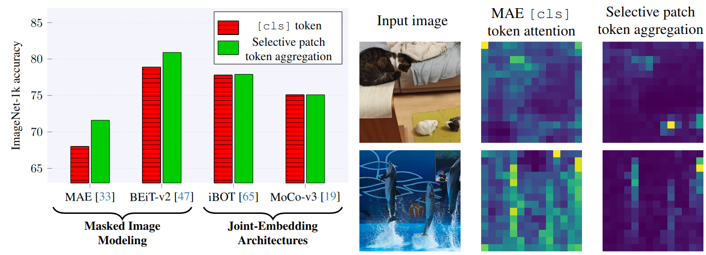

# [Beyond `[cls]`: Exploring the true potential of Masked Image Modeling representations](https://arxiv.org/abs/2412.03215)

**TL;DR:** We show that the attention mechanism of Vision Transformers trained with Masked Image Modeling causes them to form poor high-level representations, and better representations can be achieved via selective aggregation.

<p align="center">

</p>

## Overview

Masked Image Modeling (MIM) has emerged as a popular method for Self-Supervised Learning (SSL) of visual representations. 
However, for high-level perception tasks, MIM-pretrained models offer lower out-of-the-box representation quality than the Joint-Embedding Architectures (JEA) -- another prominent SSL paradigm. 
To understand this performance gap, we analyze the information flow in Vision Transformers (ViT) learned by both approaches. 
We reveal that whereas JEAs construct their representation on a selected set of relevant image fragments, MIM models aggregate nearly whole image content. 
Moreover, we demonstrate that MIM-trained ViTs retain valuable information within their patch tokens, which is not effectively captured by the global [cls] token representations. 
Therefore, selective aggregation of relevant patch tokens, without any fine-tuning, results in consistently higher-quality of MIM representations. 
To our knowledge, we are the first to highlight the lack of effective representation aggregation as an emergent issue of MIM and propose directions to address it, contributing to future advances in Self-Supervised Learning.

These scripts are based on the [official MAE codebase](https://github.com/facebookresearch/mae).


## Running the code

Dependencies are listed in `requirements.txt`.


Evaluating  MAE ViT-B + AbMILP on ImageNet-1k classification:
```
torchrun --nproc_per_node 4 --nnodes 1 --rdzv-id=$RDZV_ID --rdzv-endpoint=$HOST:$PORT --rdzv-backend=c10d \
    main_linprobe.py --amp bfloat16  --num_workers 16  --dataloader_affinity_hack \
        --epochs 90 --accum_iter 2 --optimizer lars --batch_size 2048 \
        --model vit_base_patch16 --finetune vit_base_patch16_224.mae \
        --data_path $IMAGENET_PATH --output_dir $OUT_DIR  \
        --cls_features abmilp  --abmilp_act relu --abmilp_sa none \
        --abmilp_depth 1 --abmilp_cond none --abmilp_content patch 
         
```

Calculating the attention statistics of the MAE (WANDB required):
```
export WANDB_API_KEY=...
export WANDB_PROJECT=...
export WANDB_ENTITY=...

python main_attention_stats.py --batch_size 512 --num_workers 16 \
    --model vit_base_patch16 --finetune vit_base_patch16_224.mae --input_size 224 \
    --data_path  $IMAGENET_PATH --output_dir $OUT_DIR
```

The scripts are compatible with three types of ViT encoder checkpoints:
* compatible with MAE implementation 
* compatible with SimMIM implementation (add `--simmim` flag to the scripts)
* MAE-compatible checkpoints listed in the [timm](https://github.com/huggingface/pytorch-image-models/blob/main/timm/models/vision_transformer.py) library

In the case of the first two, a path to the checkpoint should be provided with the `--finetune` argument. 
If the value of this argument is not a valid path, the script will look for this checkpoint in the `timm` library.

## Acknowledgments

This codebase is based on the fragments of the official [MAE](https://github.com/facebookresearch/mae), and [SimMIM](https://github.com/microsoft/SimMIM/tree/main) implementations.
We thank the authors for open-sourcing them.

## Citation

If you find our work interesting, please cite it:


```
@misc{przewiezlikowski2024beyondcls,
      title={Beyond [cls]: Exploring the true potential of Masked Image Modeling representations}, 
      author={Marcin Przewięźlikowski and Randall Balestriero and Wojciech Jasiński and Marek Śmieja and Bartosz Zieliński},
      year={2024},
      eprint={2412.03215},
      archivePrefix={arXiv},
      primaryClass={cs.CV},
      url={https://arxiv.org/abs/2412.03215}, 
}
```